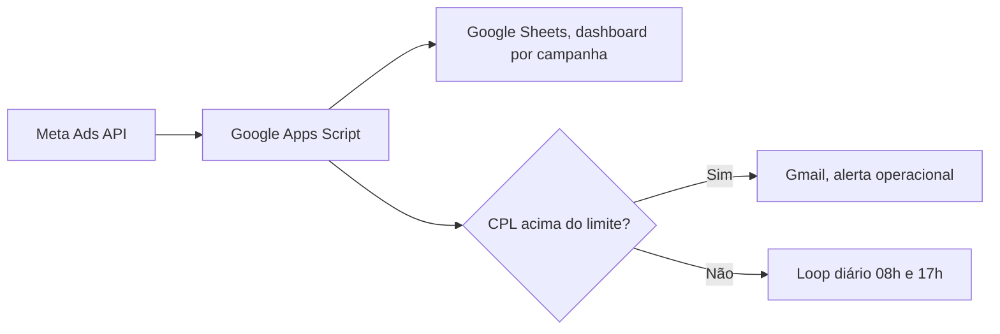

# Meta Ads, monitor de CPL e alerta operacional

Automação que coleta dados de campanhas Meta Ads, calcula custo por lead em tempo quase real, atualiza um painel em planilha e dispara alerta por e-mail quando o custo ultrapassa o limite definido para a campanha.

O problema que o sistema resolve é simples e doloroso. Em conta com mais de seis campanhas ativas, o gestor de tráfego perde duas a quatro horas por dia revisando manualmente o custo de cada campanha e decidindo onde cortar verba. Quando o gestor não está na frente da tela, o orçamento sangra. Esse monitor encurta essa janela para zero, porque a planilha está sempre atualizada e o alerta chega antes do prejuízo virar problema.

## Para quem este projeto serve

Gestor de mídia paga que opera contas Meta Ads com mais de cinco campanhas simultâneas e responsabilidade por meta de custo por lead. Funciona melhor em conta com volume diário acima de cem leads, porque abaixo disso o ruído estatístico em ciclo curto distorce o alerta.

## Arquitetura



A escolha de Google Apps Script no lugar de Python rodando em servidor foi consciente. Apps Script roda dentro do ecossistema Google de forma gratuita, com gatilho de tempo nativo, sem servidor para manter, sem credencial OAuth para renovar manualmente, e a planilha resultante já é compartilhável com o time comercial sem instalar nada. Para o caso de uso operacional do gestor de tráfego, Apps Script entrega o mesmo resultado de uma solução em Python com Cron, com fração da fricção de manutenção.

A versão em Python do mesmo monitor está disponível como alternativa em `src/meta_ads_audit.py`, para quem prefere rodar em ambiente próprio.

## Estrutura do repositório

```
.
├── README.md
├── LICENSE
├── .env.example
├── .gitignore
├── requirements.txt
├── src/
│   ├── cpl_monitor.gs        # Versão Google Apps Script
│   └── meta_ads_audit.py     # Versão Python equivalente
└── docs/
    └── arquitetura.md
```

## Como usar

Há duas formas de operar, dependendo de onde você prefere rodar.

Para a versão em Google Apps Script, copie o conteúdo de `src/cpl_monitor.gs` em um novo projeto do Apps Script, vinculado à planilha onde o dashboard vai morar. Configure as variáveis no topo do script (token de acesso da Meta Ads API, ID da conta, limite de CPL por campanha, e-mail de destino do alerta) e adicione um gatilho de tempo para rodar duas vezes ao dia, às oito horas e às dezessete horas, fuso horário local.

Para a versão em Python, copie `.env.example` para `.env` e preencha com suas credenciais. Instale as dependências com pip install menos r requirements.txt. Rode com python src/meta_ads_audit.py. Para automação diária, agende com cron em ambiente Linux ou Agendador de Tarefas em Windows.

## KPIs monitorados

Custo por lead por campanha, leads gerados por campanha no dia, total gasto no dia, total gasto acumulado no mês, e retorno sobre investimento publicitário quando o pixel de conversão está configurado.

## Resultado em produção

Operado em conta de clínica de estética high-ticket no Rio de Janeiro, com orçamento mensal acima de cento e cinquenta mil reais em Meta Ads, em parceria com agência pessoal. Resultado de quatro meses contínuos. Custo por lead caiu de quarenta e sete reais para quatro reais, redução de noventa e um por cento. O alerta operacional evitou pelo menos quatro estouros de orçamento que teriam custado em torno de oito a doze mil reais cada, e permitiu reagir a saturação de público em menos de seis horas em vez dos três a cinco dias do ciclo manual anterior.

## Limitações conhecidas

A API do Meta Ads tem atraso de até três horas para reportar conversão atribuída ao primeiro clique, portanto o cálculo de custo por lead em ciclo de alta velocidade tem ruído natural. O monitor compensa parcialmente isso usando janela móvel de vinte e quatro horas, mas em campanhas com volume diário abaixo de cinquenta leads o sinal ainda é volátil. Em campanhas de baixo volume, recomendo usar o monitor com média móvel de três dias em vez do dado bruto diário.

O alerta por e-mail depende da política do servidor de destino. Em conta corporativa com filtros agressivos, vale configurar o endereço de origem como remetente confiável.

## Versionamento

Versão atual: 1.0.

Versão 1.1 (planejada): integração opcional com Slack via webhook, para times que preferem alerta em canal de operação no lugar de e-mail. Comparação automática com benchmark de mercado por vertical, usando dados públicos do Meta Ads Library e do Wordstream.

## Licença

MIT. Veja o arquivo LICENSE.
