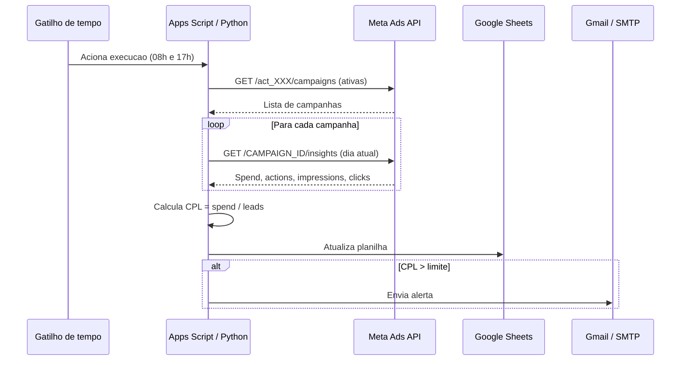

# Arquitetura do monitor de CPL

## Decisao tecnica principal

A escolha de Google Apps Script como tecnologia primaria, em vez de Python rodando em servidor proprio, nao foi por economia de codigo. Foi por economia de manutencao operacional, que e o tipo de custo escondido que mata projeto interno de gestor de trafego ao longo do tempo.

Apps Script roda dentro do ecossistema Google sem servidor, com gatilho de tempo nativo, autorenovacao de credencial OAuth, e a planilha resultante ja e compartilhavel com o time comercial sem treinamento. Para o caso de uso operacional, Apps Script entrega o mesmo resultado de Python com cron, com fracao da friccao.

A versao Python existe como alternativa para quem precisa rodar em ambiente proprio por exigencia de seguranca ou integracao com pipeline de dados existente.

## Fluxo de execucao

## Tratamento de erro

A funcao principal envolve todo o fluxo em try catch. Em caso de falha, dispara e-mail para o destinatario configurado com o stack trace resumido. Isso garante que falha silenciosa nao acontece (cenario classico de "o monitor parou de funcionar e ninguem percebeu por tres semanas").

Codigo de retorno na versao Python: zero para sucesso, um para qualquer falha. Isso permite que cron, agendador ou pipeline detecte falha e tome acao apropriada.

## Limites da Meta Ads API

A Meta Ads API tem rate limit por aplicativo e por conta. Em conta com mais de cinquenta campanhas ativas, a coleta sequencial pode levar quarenta a sessenta segundos. Para volume maior, recomendo passar para chamadas em batch usando o endpoint /act_XXX/insights diretamente, agrupando por campaign_id em uma unica request. O codigo atual prioriza clareza sobre performance porque o caso de uso tipico (conta de gestor de trafego solo) tem volume baixo o suficiente para que essa otimizacao seja desnecessaria.

## Janela de calculo de CPL

A API do Meta Ads atribui conversao ao clique original com janela padrao de sete dias. Em ciclo de alta velocidade (campanha em primeiras horas de veiculacao), o CPL bruto do dia tem ruido natural porque parte dos leads de hoje vai ser atribuida a cliques de ate sete dias atras. Para uso operacional do alerta, isso e aceitavel. Para analise estrategica de tendencia, vale puxar dados com janela movel de tres a sete dias.

## Decisoes de seguranca

Token de acesso da Meta Ads e credencial SMTP nunca aparecem em codigo fonte. Na versao Apps Script, ficam em PropertiesService.getScriptProperties(), gerenciada pela propria conta Google que executa o script. Na versao Python, ficam em arquivo .env local, listado no .gitignore. Nenhuma das duas vai parar em commit publico.
